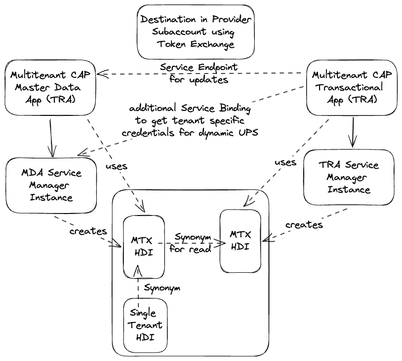

# Multitenant CAP Reviews

This project demonstrates the integration to another CAP multitenant application using HANA Synonyms. The application providing the Books entity is [mtxs-bookshop](https://github.com/gregorwolf/mtxs-bookshop). The mtxs-bookshop defines HANA Roles ([BOOKSHOP.hdbrole](https://github.com/gregorwolf/mtxs-bookshop/blob/main/db/src/BOOKSHOP.hdbrole) and [BOOKSHOP_O.hdbrole](https://github.com/gregorwolf/mtxs-bookshop/blob/main/db/src/BOOKSHOP_O.hdbrole)) that allow this app to access the HANA Table `MY_BOOKSHOP_BOOKS`.

To achieve this functionality in a multitenant application we make use of a dynamically defined user provided service that gets its credentials from the service manager instance of the mtxs-bookshop app.



## Why

You might ask why to integrate two CAP applications in this way. Wouldn't an API based approach the better solution? I don't think so because as documented in [Limitations and Feature Matrix](https://cap.cloud.sap/docs/guides/using-services#limitations-and-feature-matrix) of the CAP documentation on [Consuming Services](https://cap.cloud.sap/docs/guides/using-services) there is quite an overhead in using the API based approach. It would require a lot of additional code in the handlers.

## Setup

### Local Development

```
cf create-service-key mtxs-reviews-db mtxs-reviews-db-key

cds bind -2 mtxs-reviews-db
```

Copy the entry created by the previous command from the `.cdsrc-private.json` file as the following command will replace it:

```
cds bind -2 mtxs-bookshop-db
```

Edit `.cdsrc-private.json` and paste the backup. Replace "name": "db" with "name": "mtxs-bookshop-db" for the "instance": "mtxs-bookshop-db".

To avoid issues with a wrong binding selection make sure to [oversteer the default VCAP lookup](https://cap.cloud.sap/docs/releases/dec23#changes-in-node-js) by this configuration in `.cdsrc-private.json`:

```
        "vcap": {
          "name": "mtxs-reviews-db",
          "label": false
        }


        "vcap": {
          "name": mtxs-bookshop-db",
          "label": false
        }
```
